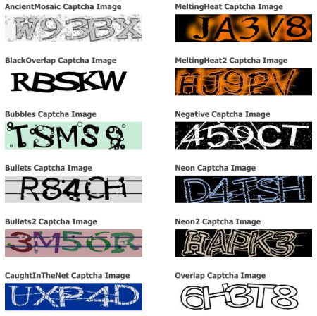
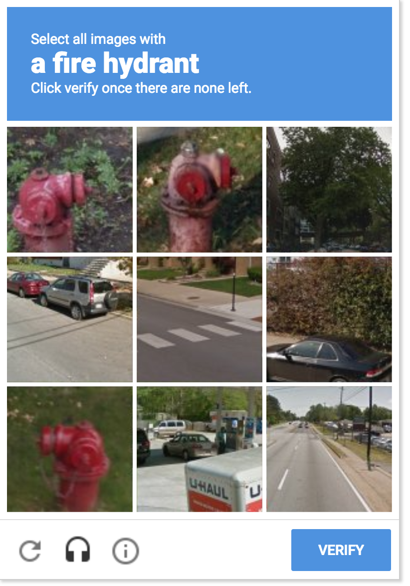

# Generating Captcha Images using GAN
<!-- 
 -->

<!-- vim-markdown-toc GFM -->

* [Introduction](#introduction)
    * [1. Motivation](#1-motivation)

<!-- vim-markdown-toc -->

## Introduction

### 1. Motivation

CAPTCHA (Completely Automated Public Turing tests to Computers and Humans Apart) technology was developed to filter out bots from submitting too many requests in a very short time interval. Captcha V2 can be easily conquered using various ways as it only consists of letters and digits. But there is no decent approach to solve Captcha V3 yet. Images caption is a challenging task. However, it would be very interesting to solve captcha images using machine learning algorithms. As machine learning mimics the way human learn and think. Before approaching to make a model, one has to figure out how to prepare the dataset. Bad news #1: there is no existing dataset containing a considerable amount of Captcha images. Bad news #2, it requires a lot of effort to label images. Fortunately, one could generate Captcha images endlessly using GAN (Generative Adversarial Network) developed by Ian Goodfellow. GAN involves two neural networks competing with each other to create more and more realistic samples. This is the reminiscence of reinforcement learning in image processing. In this project, we will develop a model to generate high-quality Captcha images. These images will be used to train a model that solves Captcha V3 automatically in the next project.

Captcha V2                                  | Captcha V3
:------------------------------------------:|:-------------------------------------------:
</img> |</img>
Only involves letters and digts             | Hard to solve even for humans

